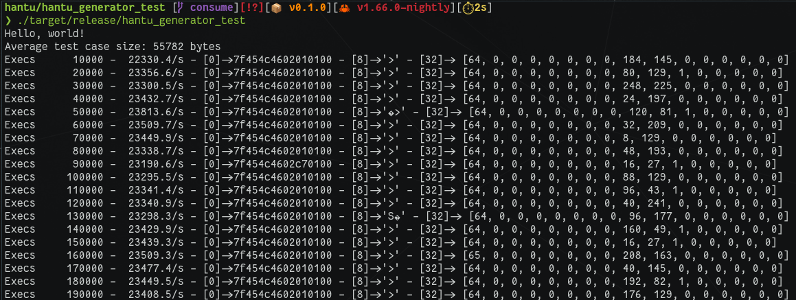

# hantu

This is a basic single threaded fuzzing mutator that either generates random input from scratch or mutates files from a corpus.  
Up to 10% (arbitrarily chosen) are mutated.  
This in turn means, the larger the files in the input corpus the slower the mutation.  
It probably would be nice to make the mutation maximum a tweakable while also adding a `corpus.trim()` option that removes dead weight.  
For example such that do not produce more code coverage or improve any other fuzzing metric.  
However, as this is up to the fuzzers core logic and not work of the mutator it's intentionally being left out here.  

## Demo

```
cd hantu_generator_test
cargo build --release
./target/release/hantu_generator_test
```


