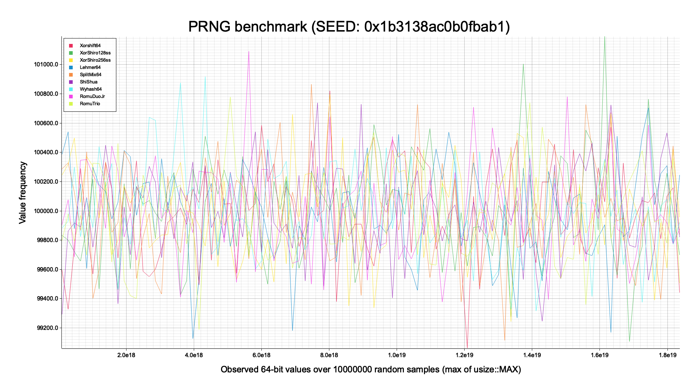

# Readme

Some pre-eliminary results for the custom PRNG implementations.
This was all tested on a MacBook Pro with a M1 Pro CPU

```text
PRNG: Xorshift64
Chi-squared: 100.37783999999999
P-value: 0.44242871365086467
Total duration: 49.169917ms
Average runtime per generated random number: 4ns

PRNG: XorShiro128ss
Chi-squared: 121.57905999999997
P-value: 0.06138774255396373
Total duration: 39.852375ms
Average runtime per generated random number: 3ns

PRNG: XorShiro256ss
Chi-squared: 94.47892
P-value: 0.609778379153988
Total duration: 36.620333ms
Average runtime per generated random number: 3ns

PRNG: Lehmer64
Chi-squared: 98.91651999999995
P-value: 0.48346070521265094
Total duration: 44.212875ms
Average runtime per generated random number: 4ns

PRNG: SplitMix64
Chi-squared: 113.59931999999999
P-value: 0.14978520835857312
Total duration: 28.076667ms
Average runtime per generated random number: 2ns

PRNG: ShiShua
Chi-squared: 100.00207999999999
P-value: 0.45290037484195544
Total duration: 33.567875ms
Average runtime per generated random number: 3ns

PRNG: Wyhash64
Chi-squared: 99.13079999999998
P-value: 0.47739725848081327
Total duration: 28.704125ms
Average runtime per generated random number: 2ns

PRNG: RomuDuoJr
Chi-squared: 104.53410000000004
P-value: 0.3323703220819887
Total duration: 31.806291ms
Average runtime per generated random number: 3ns

PRNG: RomuTrio
Chi-squared: 96.49719999999998
P-value: 0.5524629597499985
Total duration: 59.310125ms
Average runtime per generated random number: 5ns

``=-=-=-=-=-=-=-=-=-=-=-=-=-=-=-=-=-=-=-=-=-=-=-=-=-=-=-=-=-==-=-=-=-=-=-=
Entropy: Xorshift64 with seed 1959409624453986993 -> 7.99 bits per byte
=-=-=-=-=-=-=-=-=-=-=-=-=-=-=-=-=-=-=-=-=-=-=-=-=-=-=-=-=-==-=-=-=-=-=-=
Entropy: XorShiro128ss with seed 1959409624453986993 -> 7.99 bits per byte
=-=-=-=-=-=-=-=-=-=-=-=-=-=-=-=-=-=-=-=-=-=-=-=-=-=-=-=-=-==-=-=-=-=-=-=
Entropy: XorShiro256ss with seed 1959409624453986993 -> 7.99 bits per byte
=-=-=-=-=-=-=-=-=-=-=-=-=-=-=-=-=-=-=-=-=-=-=-=-=-=-=-=-=-==-=-=-=-=-=-=
Entropy: Lehmer64 with seed 1959409624453986993 -> 7.99 bits per byte
=-=-=-=-=-=-=-=-=-=-=-=-=-=-=-=-=-=-=-=-=-=-=-=-=-=-=-=-=-==-=-=-=-=-=-=
Entropy: SplitMix64 with seed 1959409624453986993 -> 7.99 bits per byte
=-=-=-=-=-=-=-=-=-=-=-=-=-=-=-=-=-=-=-=-=-=-=-=-=-=-=-=-=-==-=-=-=-=-=-=
Entropy: ShiShua with seed 1959409624453986993 -> 7.99 bits per byte
=-=-=-=-=-=-=-=-=-=-=-=-=-=-=-=-=-=-=-=-=-=-=-=-=-=-=-=-=-==-=-=-=-=-=-=
Entropy: Wyhash64 with seed 1959409624453986993 -> 7.99 bits per byte
=-=-=-=-=-=-=-=-=-=-=-=-=-=-=-=-=-=-=-=-=-=-=-=-=-=-=-=-=-==-=-=-=-=-=-=
Entropy: RomuDuoJr with seed 1959409624453986993 -> 7.99 bits per byte
=-=-=-=-=-=-=-=-=-=-=-=-=-=-=-=-=-=-=-=-=-=-=-=-=-=-=-=-=-==-=-=-=-=-=-=
Entropy: RomuTrio with seed 1959409624453986993 -> 7.99 bits per byte`
``` 


## Xorshift64


## XorShiro256ss


## Lehmer64


## SplitMix64


## ShiShua


## Wyhash64


## RomuDuoJr


## RomuTrio


```

